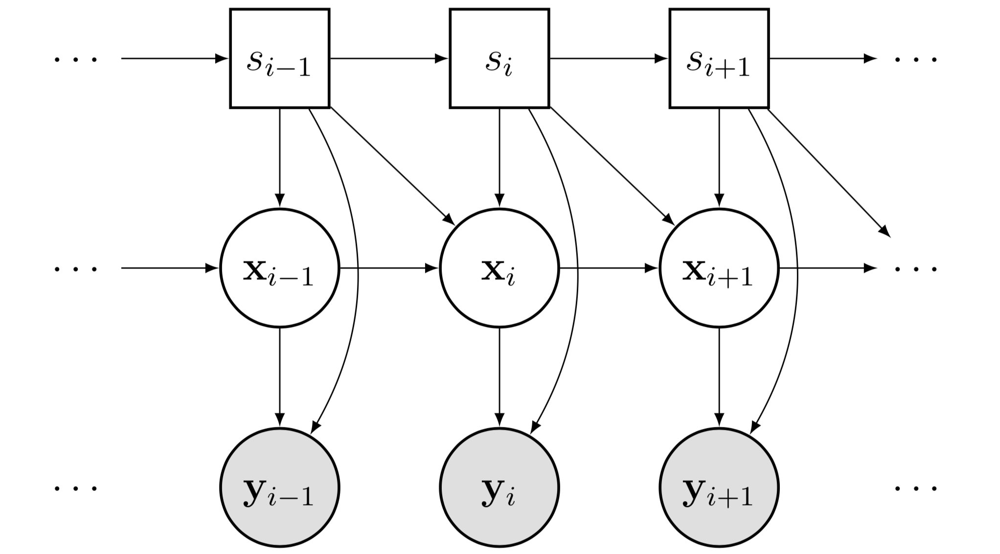

```{r setup, include = FALSE}
knitr::opts_chunk$set(
  echo = FALSE,
  collapse = TRUE,
  comment = "#>"
)
```

This package is intended to estimate Markov switching state-space models using maximum likelihood _fast_. The basic model this package examines is illustrated with the graphical model:
```{r SSM-DAG, out.width="200pt", fig.align='center'}

```
where filled objects are observed, rectangles are discrete, and circles are continuous.  Switching state-space models have a long
history with many applications from
economics [@KimNelson1998;@Kim1994;@Hamilton2011] to speech
processing [@FoxSudderth2011] to animal
movement [@PattersonThomas2008;@BlockJonsen2011]. An excellent
overview of the history, typography, and algorithmic developments can
be found in [@GhahramaniHinton2000]. 

Our implementation of the Markov switching model allows the parameter matrices
of a linear Gaussian state-space model to depend on $s_i, s_{i-1}$:
\begin{equation}
  \begin{aligned}
    x_1 &\sim N(x_0,\ P_0),\\
    x_{i+1}&= d(s_i,s_{i-1})+T(s_i,s_{i-1}) x_i +
    R(s_i,s_{i-1})\eta_i, 
    & \eta_i &\sim N(0,Q(s_i,s_{i-1})),\\
    y_i&= c(s_i) + Z(s_i) x_i + \epsilon_i, & \epsilon_i &\sim N(0, G(s_i)).
  \end{aligned}
\end{equation}
In other words, the hidden Markov (switch) state determines which parameter
matrices govern the evolution of the system. If the  matrices above depend on a vector of unknown parameters $\theta$, one needs to jointly estimate the switch path $S_1,\ldots,S_n$, the continuous hidden states $X_1,\ldots,X_n$, and the parameter vector.

## Why this package?

Most available packages on CRAN are for state-space models only (not switching) or for hidden Markov models only (without continuous hidden states). Without switch states, the Kalman filter [@Kalman1960] returns the likelihood of a parameter vector $\theta$, and the Kalman smoother gives the estimates of the hidden continuous states conditional on all the observed data. In the case of an HMM, the Viterbi algorithm is analogous to the Kalman smoother, producing the most likely path conditional on all the data.

However, when combined, computing the likelihood for $\theta$ or producing the most likely path becomes exponentially hard: given 2 possible values for $S_i$, there are $2^n$ possible sequences $(S_1,\ldots,S_n)$. Maximizing the likelihood for $\theta$ then means evaluating the Kalman filter at each of these paths _for each proposed value of $\theta$_.

## Contribution

The `dpf` package provides a lightweight, fast, greedy method for calculating the likelihood of $\theta$. It is implemented in C++ using `Rcpp` and takes advantage of an accurate algorithm for finding the most likely state sequence proposed in [@FearnheadClifford2003].

We provide 3 main functions which are useful for generic switching state space models:

1. `kalman()` computes the standard Kalman filter and smoother given a collection of parameter matrices which are allowed to be time dependent. It returns the likelihood, means and variances for the filter and smoother distributions, and predicted values for the observations.

2. `beamSearch()` implements the Greedy HMM algorithm. For any $N$, it attempts to compute the $N$ most likely sequences $(S_1,\ldots,S_n)$ given a collection of parameter matrices which are time and state dependent. The result is this collection of paths as well as probabilities associated with each of the $N$ paths. Using the path with the highest weight in `kalman()` then corresponds to a frequentist evaluation of a particular parameter $\theta$ while sampling proportional to the weights allows for approximate Bayesian inference (ignoring the $s^N-N$ paths which presumably have negligible likelihood).

3. `getLogLike()` computes only the components of the Kalman filter necessary to evaluate the likelihood.

For a generic switching state-space model whose evolution matrices depend on an unknown vector $\theta$, one would use `beamSearch()` and `getLogLike()` combined with any standard optimization method to produce an ML estimate $\widehat{\theta}$. Then, for $\widehat{\theta}$, one would use `beamSearch()` and `kalman()` to return the ML estimates for $(S_1,\ldots,S_n)$ and $(X_1,\ldots,X_n)$.

The next section provides a brief illustration of applying these functions to an application from classical music.

## Switching models for musical tempo decisions

The remaining functions in `dpf-package` are created for our in-progress manuscript which proposes a switching model for the decisions made by classical music performers. Our model essentially imagines that musicians have an intentional tempo for a piece of music which is partially determined by a Markov chain on 4 states: constant tempo, acceleration, deceleration, and stress. While our working manuscript provides the details, we here illustrate the `beamSearch()` function on a recording of Chopin's Mazurka Op. 68 No. 3 made by the famous Russian pianist Nina Milkina in 1970. We estimated $\theta$ offline. The `musicModel()` function creates the appropriate parameter matrices in the above equation given $\theta$.

```{r music-preprocessing}
library(dpf)
data(tempos) # load observed tempos of this and many other performances
theta = c(426.69980736, 136.33213703, -11.84256691, -34.82234559, 
          439.37886221, 1, 1, 0.84916635, 0.04611644, 0.74119571,
          0.43966082, 0.02116317, 0.24513563, 0.17253254)
# parameters estimated offline
lt = diff(c(tempos$note_onset,61)) # notated durations
```

```{r code-illustration, echo=TRUE}
y = matrix(tempos$Richter_1976, 1)
pmats = musicModel(lt, theta[1], theta[2:4], theta[5:7], theta[8:14], 
                   c(132,0), c(400,10)) # prior means and variances on X_1
beam = with(pmats, beamSearch(a0, P0, c(1,rep(0,10)), dt, ct, Tt, Zt,
                  HHt, GGt, y, transMat, 200))
bestpath = with(beam, paths[which.max(weights),])
kal = kalman(pmats, bestpath, y)
```


This figure shows the observed note-by-note speed of the recording (black line) and the estimated discrete states (colored dots). The musical form is in three sections (ABA). The contrasting "B" section is marked with a grey area.
```{r plot-our-model, fig.align='center'}
plotStates('Richter_1976', theta, tempos$Richter_1976, tempos$note_onset)
```

## Installation

Using the `devtools` package, one can install the most current version of  `dpf` with
```{r, echo=TRUE, eval=FALSE}
devtools::install_github('dajmcdon/dpf')
```


## References